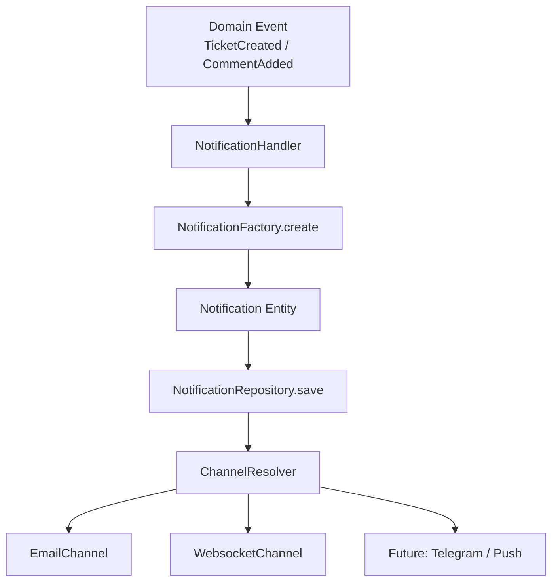

# Реализация модуля нотификации

## Общая архитектура

```mermaid
graph TD
    A[Domain Event<br/>TicketCreated / CommentAdded] --> B[NotificationHandler]
    B --> C[NotificationFactory.create]
    C --> D[Notification Entity]
    D --> E[NotificationRepository.save]
    E --> F[ChannelResolver]
    F --> G[EmailChannel]
    F --> H[WebsocketChannel]
    F --> I[Future: Telegram / Push]
```
