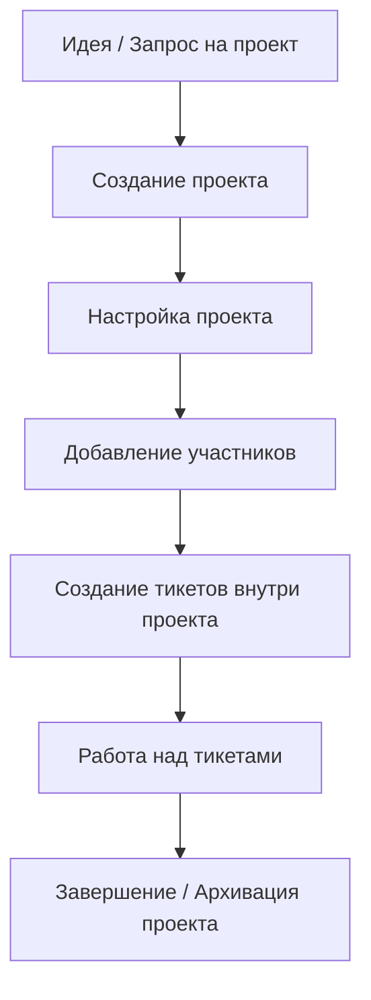

# Жизненный цикл проекта

## Подробное описание жизненного цикла

| Этап            | Кто создаёт / выполняет | Что происходит                                                     | Статус проекта |
|-----------------|-------------------------|--------------------------------------------------------------------|----------------|
| Создание        | Support Manager / Admin | Создаётся проект, указывается название, ключ, контрагент, владелец | ACTIVE         |
| Настройка       | Owner проекта + Manager | Добавляются участники, настраиваются права, workflow (опционально) | ACTIVE         |
| Активная работа | Все участники проекта   | Создаются тикеты, ведётся работа, добавляются комментарии          | ACTIVE         |
| On Hold         | Owner / Manager         | Проект временно приостановлен (например, клиент не отвечает)       | ON_HOLD        |
| Завершение      | Owner / Manager         | Все тикеты закрыты, проект отмечается как завершённый              | COMPLETED      |
| Архивация       | Manager / Admin         | Проект больше не активен, тикеты доступны только для чтения        | ARCHIVED       |

## Взаимодействие клиента с проектом

| Действие                   | Customer         | Customer Admin                     | Support Agent      | Support Manager |
|----------------------------|------------------|------------------------------------|--------------------|-----------------|
| Видеть тикеты проекта      | Только свои      | Все тикеты проекта                 | Все тикеты проекта | Все             |
| Создавать тикеты в проекте | Да               | Да                                 | Да                 | Да              |
| Комментировать тикеты      | Только публичные | Публичные + internal (ограниченно) | Да                 | Да              |
| Назначать исполнителя      | Нет              | Нет                                | Да                 | Да              |
| Менять статус тикета       | Нет              | Нет                                | Да                 | Да              |
| Добавлять других клиентов  | Нет              | Нет                                | Нет                | Да              |
